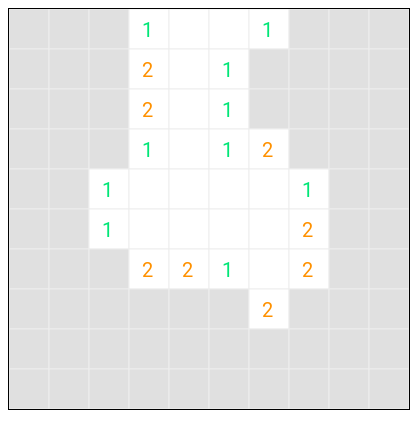
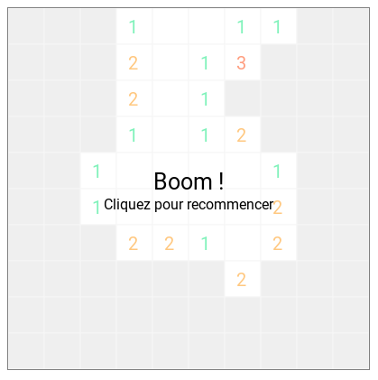
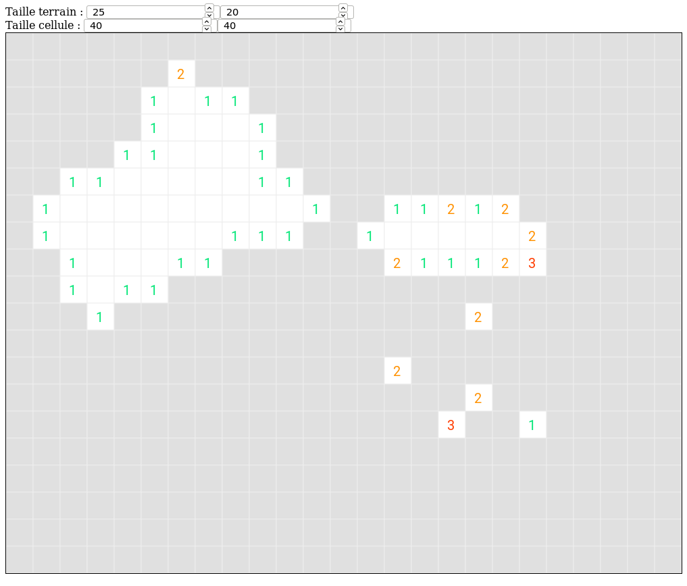
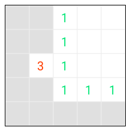

# C7z Minesweeper

Quick project for minimal minesweeper component



## How to use it

Declare in a module :

```
import { MinesweeperModule } from 'c7z-minesweeper';

...

@NgModule({
  declarations: [
    ...
  ],
  imports: [
    ...
    MinesweeperModule,
  ],
})
export class AppModule {
  ...
}

```

Declare in template :

```
<c7z-minesweeper></c7z-minesweeper>
```

or  

```
<c7z-minesweeper [fieldWidth]="10" [fieldHeight]="10" [cellWidth]="40" [cellHeight]="40"></c7z-minesweeper>
```

## Default values

Field size : 10 * 10  
Cell size : 40 * 40

## Screenshots

Game lost  


Big grid  


Small grid  

